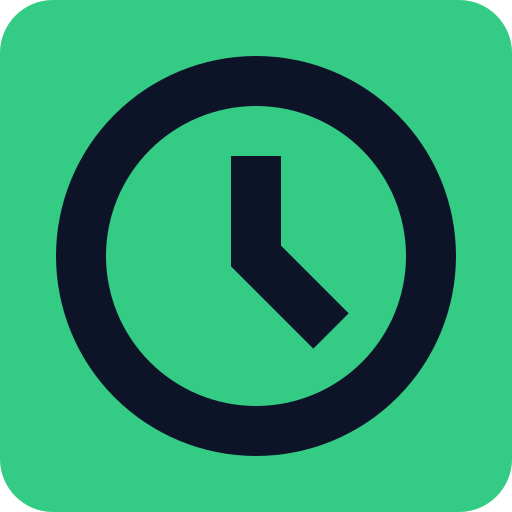

<section align="center">

  

</section>

# 

This repository contains an application that manages your future events such as meetings, parties, lectures, etc. Of course, with a nice interface.

## Technologies used

- [Node.js](https://nodejs.org)
- [Express](https://expressjs.com)
- [better-sqlite3](https://github.com/JoshuaWise/better-sqlite3)
- [Electron](https://electronjs.org)
- [Nunjucks](https://mozilla.github.io/nunjucks/)
